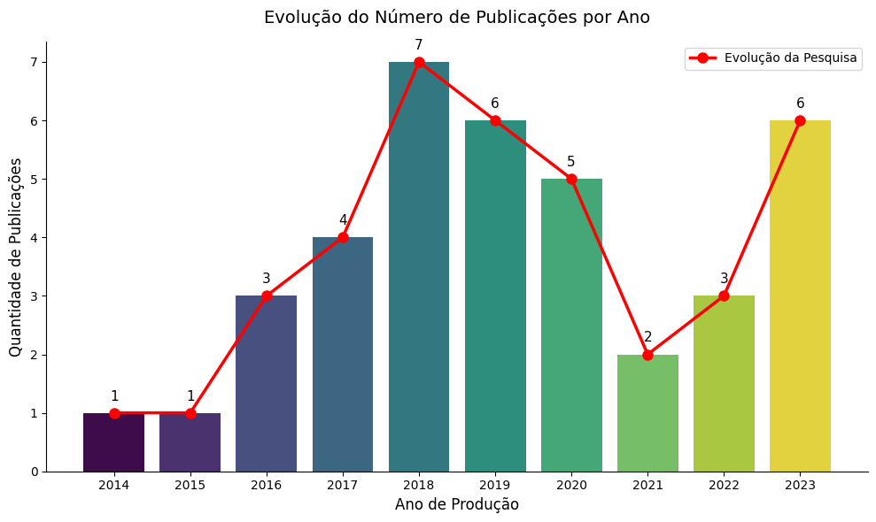
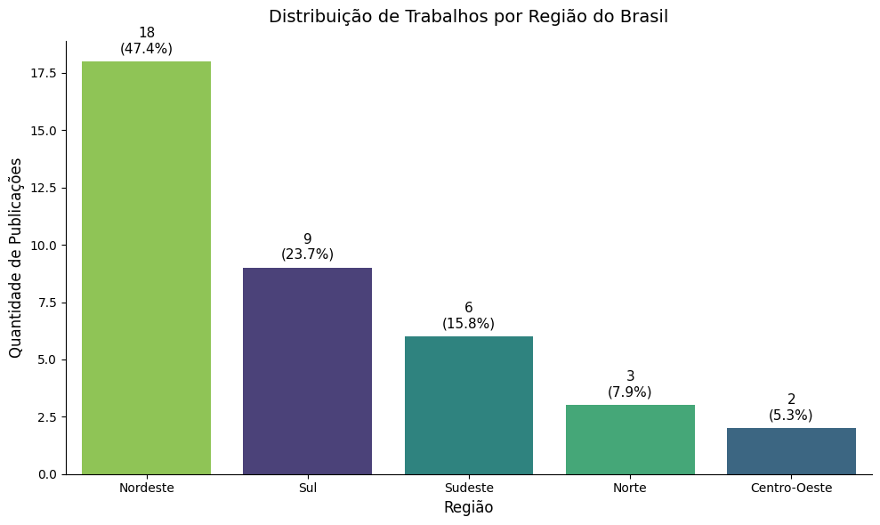
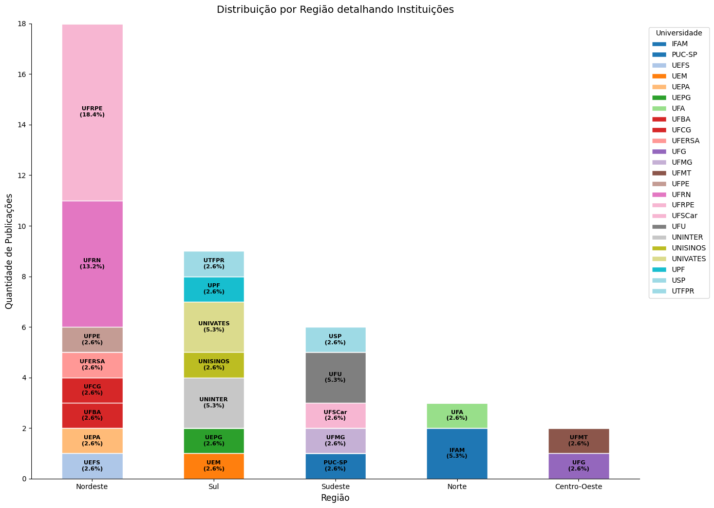
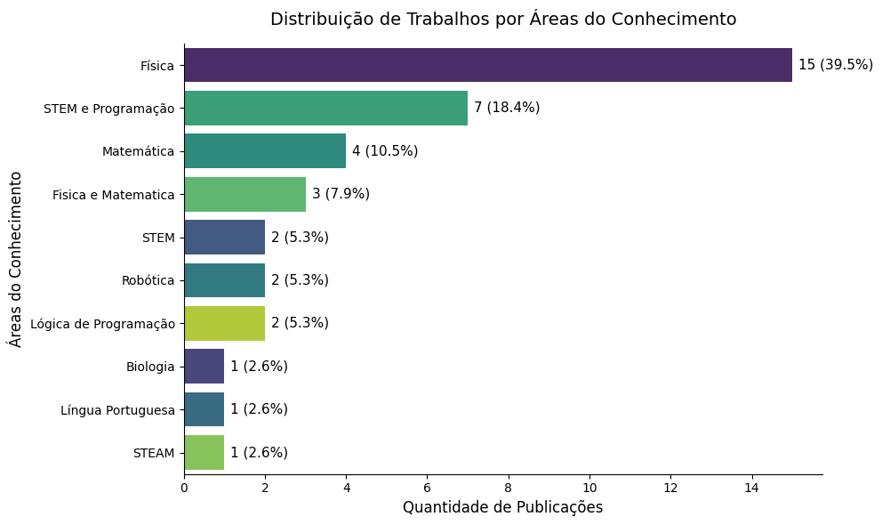
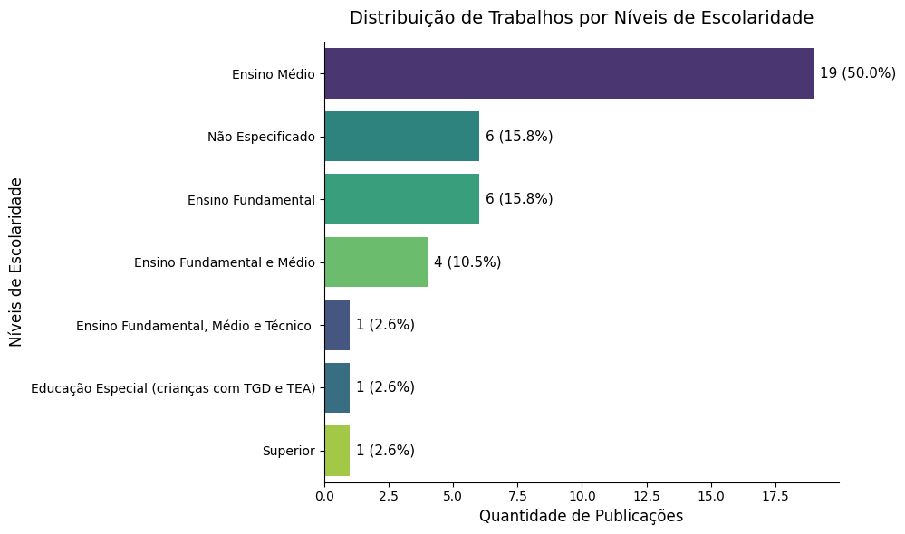
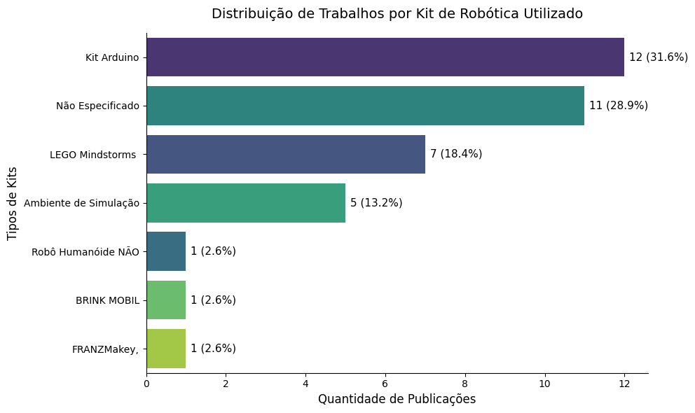

# 🤖 Ensino da Robótica na Educação Básica Brasileira
### Uma Análise da Produção Científica (2013–2023)


---

## 📋 Sobre o Projeto

Este projeto é fruto do meu **Trabalho de Conclusão de Curso (TCC) do Ensino Técnico** e tem como objetivo analisar a presença da robótica na educação básica brasileira entre **2013 e 2023**, investigando a distribuição regional das pesquisas, as áreas do conhecimento abordadas, os kits mais utilizados e os desafios enfrentados na aplicação dessa metodologia.

## 📂 Fonte dos Dados

As teses e dissertações utilizadas nesta análise foram extraídas das publicações científicas disponíveis na **Biblioteca Digital Brasileira de Teses e Dissertações (BDTD)** em outubro de 2024.

A coleta foi realizada utilizando a seguinte equação de busca:
> `"(robótica) AND (ensino básico OR ensino fundamental OR ensino médio)"`

Ao todo, foram identificadas **104 publicações**. Após a aplicação dos critérios de exclusão (trabalhos sem estudos de caso práticos, sem enfoque educacional ou sem aplicação direta com alunos), restaram **38 trabalhos (teses e dissertações)** para a análise final.

## 🛠️ Tecnologias Utilizadas

| Ferramenta | Finalidade |
|---|---|
| **Python 3.x** | Linguagem principal |
| **Pandas** | Manipulação e tratamento dos dados |
| **Matplotlib** | Criação de gráficos |
| **Seaborn** | Visualizações estatísticas |
| **Jupyter Notebook** | Ambiente de desenvolvimento da análise |


## 🔍 Estrutura da Análise (Perguntas de Pesquisa)

## 📊 Evolução Temporal das Publicações

O gráfico de evolução temporal revelou que **não houve um crescimento linear** na produção científica. O ano de **2018** destaca-se pelo pico de publicações, seguido por uma queda notável entre **2020 e 2022**, coincidindo diretamente com a **pandemia de COVID-19** — que inviabilizou pesquisas que dependiam de aplicações presenciais em ambientes escolares.



---

A Análise Exploratória de Dados (EDA) foi conduzida para responder às seguintes questões:

---

### Q1: Quais as regiões do Brasil e instituições foram representadas nas pesquisas?

A região **Nordeste** lidera de forma expressiva, concentrando quase **50%** de todas as publicações analisadas. Essa força regional é fortemente impulsionada pela **UFRPE** (7 publicações) e pela **UFRN** (5 publicações), e pode ser explicada pelo histórico de incentivo governamental à robótica educacional em Pernambuco — como o programa **"Robótica na Escola"** e a parceria estadual com a LEGO para aquisição de 3.200 kits, atendendo cerca de 320 mil alunos.





---

### Q2: Quais áreas do conhecimento foram exploradas e qual o nível de escolaridade aplicado?

A robótica foi predominantemente aplicada em disciplinas que possuem conceitos abstratos, onde a ferramenta serve como ponte para a concretização prática do aprendizado. O **Ensino Médio** concentrou a maior parte das aplicações, o que pode ser explicado pela sua exigência de competências mais complexas, alinhadas à preparação para o mercado de trabalho e aos desafios tecnológicos contemporâneos.





---

### Q3: Quais kits de robótica foram utilizados?

A análise revelou a predominância de dois kits com filosofias opostas:

* **LEGO Mindstorms:** Custo elevado, mas oferece montagem simples, programação visual em blocos e forte suporte pedagógico da empresa.
* **Kit Arduino:** Baixo custo, hardware/software livre (Open Source), permite integração com materiais alternativos e recicláveis, promovendo abordagens criativas e economicamente viáveis.



---

## 🎯 Conclusões

* **O incentivo governamental é o motor principal:** O pico de publicações no Nordeste comprova que políticas públicas focadas em inserir tecnologia nas escolas geram resultados acadêmicos e práticos imediatos.
* **Limitação e qualidade dos dados:** A amostragem final foi reduzida (38 trabalhos) e alguns autores não detalharam adequadamente os kits e métodos utilizados.
* **Barreira estrutural vs. Acessibilidade:** A falta de infraestrutura financeira das escolas brasileiras limita o uso de kits proprietários como o LEGO. O Arduino surge como alternativa democrática, permitindo um alcance territorial muito maior.
* **Impacto da pandemia de COVID-19:** A queda nas pesquisas entre 2020–2022 evidencia que a robótica educacional depende fortemente do contato presencial, infraestrutura física e manuseio de peças.
* **A robótica concretiza o abstrato:** As disciplinas que mais adotaram a robótica são justamente aquelas com conceitos difíceis de visualizar (como Física e Matemática), comprovando o poder da ferramenta como ponte entre teoria e prática.

---

## 📁 Estrutura do Projeto

```
📦 ENSINO DA ROBÓTICA NA EDUCAÇÃO BÁSICA BRASILEIRA
├── 📄 README.md                  # Este arquivo
├── 📓 tratamento.ipynb           # Notebook com toda a EDA
├── 📊 teses_e_dissertacoes.csv   # Base de dados original (104 → 38 registros)
├── 📊 dados_tratados.csv         # Dados limpos após o tratamento
└── 📂 imagens/                   # Prints dos gráficos (para o README)
```

## 👩‍💻 Como Executar

1. Clone este repositório:
```bash
git clone https://github.com/JuliaSantanaS2/robotics-education-brazil-eda.git
```

2. Instale as dependências:
```bash
pip install pandas matplotlib seaborn jupyter
```

3. Abra o notebook:
```bash
jupyter notebook tratamento.ipynb
```

---

> **Projeto desenvolvido como parte do TCC do Ensino Técnico.**
